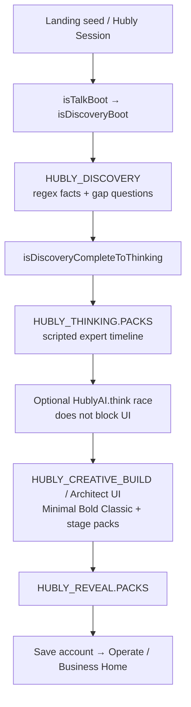
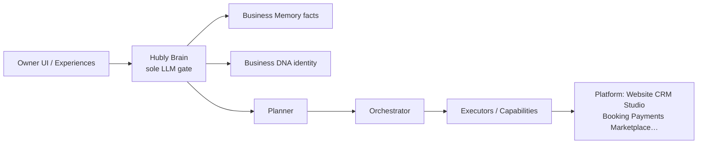
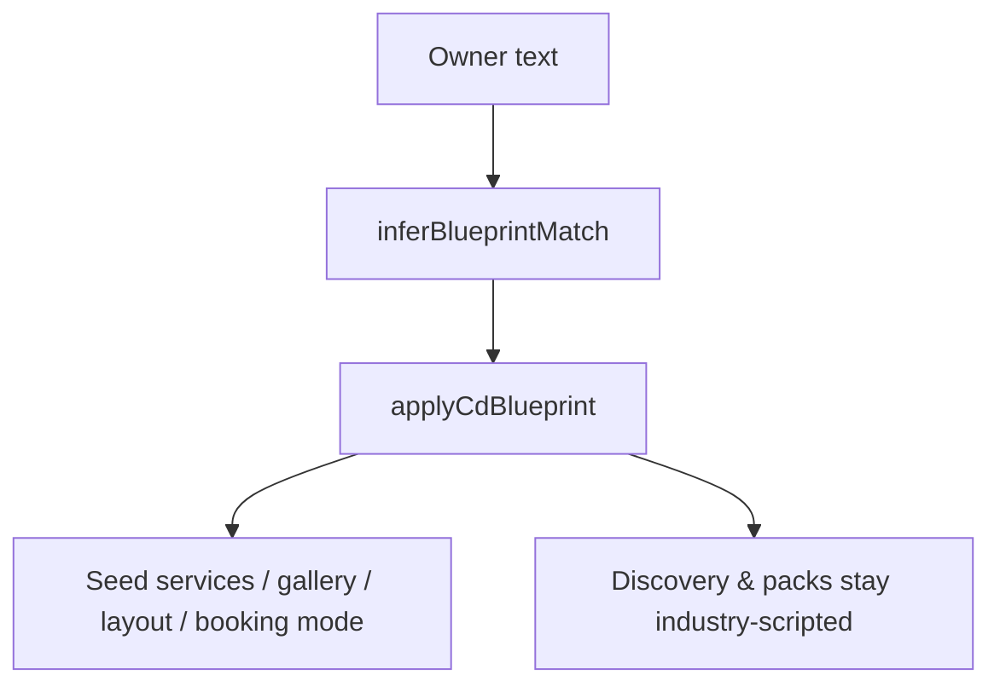
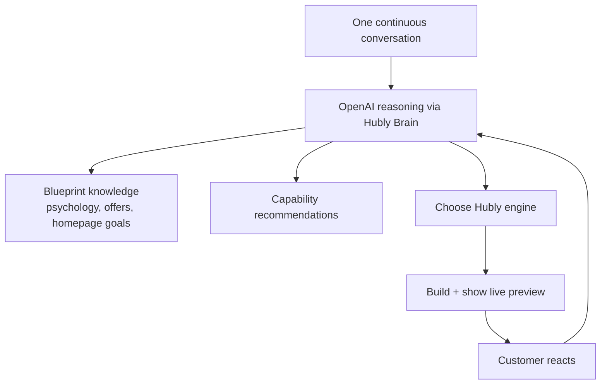
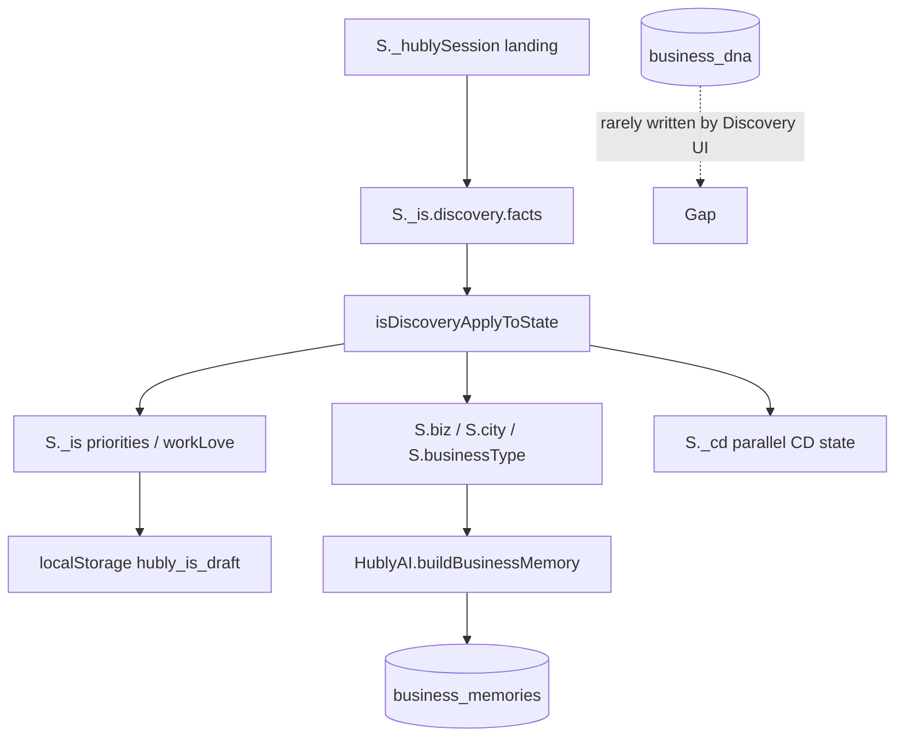
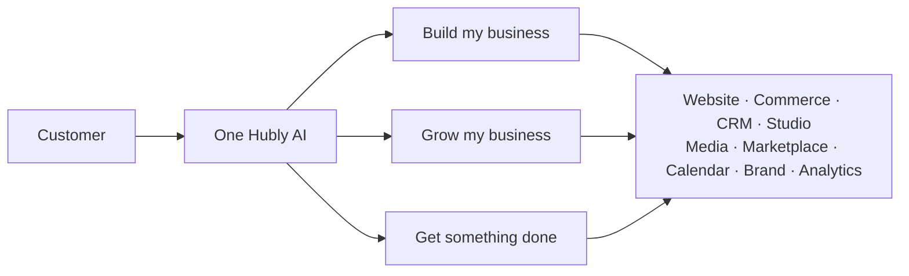
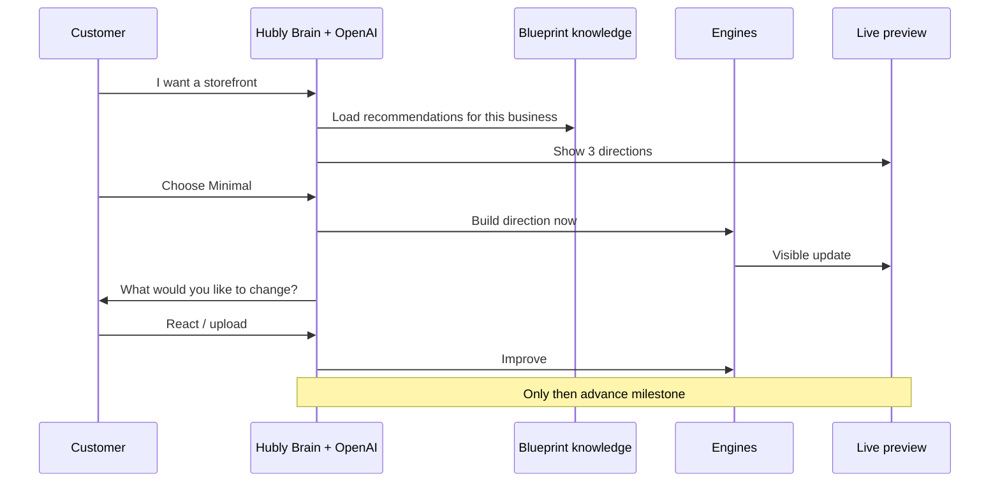

# Hubly AI V2 — Architecture Review (pre-implementation)

**Status:** Review only — no product rewrite until agreement  
**Date:** 2026-07-30  
**Success metric (locked for V2):** *Did the customer feel like they built something real with Hubly?*  
Not: “Did onboarding finish?”

This document answers the founder questions before we change large parts of the platform. It maps what exists today, where OpenAI is bypassed, what commerce can actually do, and a migration plan that reuses engines instead of rebuilding them.

---

## Executive verdict

| Area | Today | Gap vs V2 goal |
|------|-------|----------------|
| Onboarding | Scripted Discovery → Thinking packs → Architect UI → Reveal | Still a wizard wrapped in chat; packs decide the story |
| OpenAI | **Configured and working** on production (`gpt-5.5` via Responses) | Instant Site / `Hubly.think` experts mostly **do not call** the model |
| Blueprints | Industry JSON templates that seed services/layout/booking | Act as controllers, not recommendation knowledge |
| Engines | Many real surfaces (Website, CRM, Studio, Media, Marketplace, Booking, Stripe) | Customer feels module tabs, not one continuous conversation |
| Commerce | Schema + Stripe checkout path exist; owner Store UI persists to `meta.storeOs` | Dual SSOT; digital/gift cards/prints incomplete |
| Storefront screenshot | Service booking site (Pro Shine) | Not the product-commerce storefront in V2 mocks (Ember & Wick) |

**Do not rewrite large platform areas until this direction is agreed.**

---

## 1. Current architecture (as shipped)

### 1.1 Cold-start / Instant Site path (what owners actually experience)



Primary implementation: `public/hubly.html`  
Mirrors / gates: `scripts/lib/business-discovery.mjs`, `thinking-experience.mjs`, `creative-build-experience.mjs`

Architect (PR #370) improved the **shell** (chat left / live preview right, Live Sync, % Built, uploads). The **conversation content** is still pack-driven.

### 1.2 Declared Brain runtime (what status claims)



Source of truth for this vision: `docs/architecture/SYSTEM_ARCHITECTURE.md`, `supabase/functions/_shared/hubly_ai.ts` (`Hubly.status()`).

**Reality gap:** Instant Site does not wait on Brain orchestration. It plays local packs, then later may attach Memory via `HublyAI.buildBusinessMemory()` / `syncBusinessMemory` after a business exists.

---

## 2. Where onboarding is hardcoded today

| Layer | Location | What is hardcoded |
|-------|----------|-------------------|
| Discovery gaps | `HUBLY_DISCOVERY` in `hubly.html` + `scripts/lib/business-discovery.mjs` | 7 predetermined questions, industry regex, confidence thresholds (ready ≈ 78 / max 3 clarifications) |
| Thinking show | `HUBLY_THINKING.PACKS` | Research → Strategy → Creative → Critic narrative per industry |
| Architect / Creative Build | `HUBLY_CREATIVE_BUILD.PACKS` | Stage order, explain copy, BTS lines, checklist, 3 directions |
| Reveal | `HUBLY_REVEAL.PACKS` | Pride copy, section “why”, alternatives |
| Legacy talk beats | `isTalkAskCurrent` / `cdBeats` | owner → biz → phone → trade → … and CD 7-beat rail (still in code) |
| Interrupts | `applyInterruptToBuild` | Keyword → theme (minimal/bold/classic) — no LLM |
| Intent chips | `ARCHITECT_INTENTS` / `inferIntent` | Build / Grow / Get something done via regex |

### Predetermined Discovery questions (current)

1. What kind of work do you do day to day — the thing customers actually hire you for?  
2. Are you mostly working around one city, or do you travel quite a bit?  
3. Is this something you're just getting off the ground, or have you been doing it for a while?  
4. When customers choose you, what do you hope they remember?  
5. Are you mostly working with homeowners, or more commercial properties?  
6. If we made one thing better in the next few weeks, what would help you most?  
7. Are you mostly flying solo right now, or do you already have people helping?

These are exactly the “interview” feeling the V2 direction rejects.

---

## 3. Decisions made by code instead of OpenAI

| Decision | Decided by code today |
|----------|------------------------|
| Industry / trade | Regex + `inferBlueprintMatch` |
| Next Discovery question | `pickNext` + confidence math |
| When Discovery ends | Threshold / clarification cap |
| Thinking narrative | Industry `PACKS` |
| Build stage order & copy | Creative Build `PACKS` |
| Direction themes | Fixed Minimal / Bold / Classic |
| Mid-build feedback timeouts | Client timers (auto-continue) |
| Preview packages / CTAs | `isCreativeApplyStage` templates |
| Reveal story | Reveal `PACKS` |
| Blueprint → services, gallery, booking mode | `applyCdBlueprint`, seeds |

OpenAI is used on **other** product paths (Creative Director edge, draft messages, chatbot, generate-site, some executors) — not as the Instant Site orchestration layer.

---

## 4. Business Blueprints — current vs proposed role

### Current (controller)



Assets: `public/business-blueprints/*.json` via `HublyBlueprints` / `registry.js`.

Blueprints today **drive** catalog, homepage goals, and onboarding assumptions. They do not sit behind an AI decision loop.

### Proposed V2 (knowledge + recommendations) — **do not remove**



**Rule for V2:** Blueprints never dictate a scripted onboarding. They advise. AI decides.

---

## 5. Where we limit OpenAI’s reasoning

| Mechanism | Effect |
|-----------|--------|
| Instant Site `PACKS` / `orchestrate*` | Deterministic experience objects |
| `Hubly.think` experts (~0–4ms each) | Template experts; `aiProvider: null` on live probes |
| `HublyAI.think` race in Thinking | Optional; UI does not wait |
| `buildBusiness({ dryRun })` | Often planning/scaffold without creative LLM |
| Interrupt regex | No model for “make it more premium” |
| Unknown industry → `pressure_washing` default | Collapses novel businesses into home-service packs |

### OpenAI API health check (2026-07-30, production)

Project: `rtwxxkxpkqdrhclkozma.supabase.co`

| Probe | Result |
|-------|--------|
| `hubly-brain` `action=status` → `configured.openai` | **true** |
| Foundation `gpt55Connected` | **true** |
| Default reasoning model | **gpt-5.5** (Responses transport) |
| Live `draft-customer-message` | **200** · `meta.provider: openai` · `model: gpt-5.5` · ~3.7s |
| Live `creative-director` | **200** · `model: gpt-5.5` · ~9.3s · coherent Ember Wick reply |
| Live `hubly-brain` `think` (“17×19”) | **ok** but **~107ms**, experts 0–4ms, templated home-service language — **not a real model round-trip** |

**Conclusion:** OpenAI is configured and works when edges call `HublyAI.complete` / task routes. The onboarding orchestration path largely **avoids** that gate. V2’s core job is to make Brain + OpenAI the conductor of Instant Site, not a spectator.

---

## 6. Existing Hubly engines — map

| Engine / surface | Completeness | Connected to AI/onboarding? | Notes |
|------------------|--------------|-----------------------------|-------|
| Website / Instant Site | Partial–strong | Connected (scripted) | Preview Engine exists in Brain; Instant Site UI is separate |
| Commerce / Store | Partial | Weak (local coach stubs) | Dual SSOT: `meta.storeOs` vs `commerce_*` |
| Website Storefront (services) | Strong UI | Connected as service catalog | Screenshot = booking site, not product shop |
| CRM / Customers | Partial–strong | Scaffold via capabilities | Journey OS persist uneven |
| Studio | Partial (V1 email publish) | Connected (briefs/recs) | Replaces Marketing OS |
| Media / Photo projects | Partial–strong | Connected to Studio bridge | Print *sales* missing |
| Business Memory | Complete (core) | Connected after business exists | Facts only |
| Business DNA | Complete (core) | Underused by Instant Site UI | Identity — keep separate from Memory |
| Analytics | Partial / local | Weak | Reports/Store analytics often OS-local |
| Marketplace / findPro | Partial–strong | Connected (`Hubly.findPro`) | Invisible marketplace product rule |
| Calendar | Partial–strong | Jobs OS + Google Connect | Some Settings still Stage 2 |
| AI / Coach / Collaboration | Partial–strong | Brain strong; Operate Ask Hubly often local | Collaboration/Preview = Brain epics |
| Email | Partial | Resend when keyed | Fail honestly if missing |
| Brand Kit | Partial–strong | Studio + Instant Site | Not a separate OS tab forever |
| Service Engine / Booking / Packages | Strong | Connected | Frozen Service Engine |
| Intent / Action engines | Partial | Used in places | Not universal Operate router |
| Payments / Stripe Connect | Partial–strong | Booking + store checkout | Revenue ledger Stage 1 local |
| Capabilities / Planner / Orchestrator / Understanding | Core complete | Instant Site underuses live path | Soft/stub caps remain |

---

## 7. Business Context flow & state duplication

### Intended flow

```
Conversation → Understanding → Memory (facts) + DNA (identity)
            → Planner → Orchestrator → Capabilities → Platform
```

### Actual Instant Site flow (duplicated state)



**Duplication hotspots**

- Discovery facts ↔ `S.*` ↔ draft snap  
- `S._is.onboardingPriority` ↔ `S.onboardingPriority`  
- City / area chips ↔ `S.city` ↔ `serviceAreaCities`  
- Industry label ↔ CD `whoText` ↔ seed prompt  
- Learning lines in UI ↔ Reveal capsule ≠ Memory/DNA tables  

**V2 rule (unchanged):** never merge Memory (facts) with DNA/Profile (identity). Understanding may write both — separately labeled.

---

## 8. Storefront / commerce backend audit

### 8.1 Two different “storefronts”

| Name | What it is | Screenshot / mock |
|------|------------|-------------------|
| **Website Storefront** | Services, booking, gallery, reviews, SEO | `screenshots/Storefront.png` — **Pro Shine Detailing** (Book Now, service cards, before/after). Placeholders for map / FAQ / some gallery categories. |
| **Store / Commerce Engine** | Products, carts, product orders | V2 mocks (Ember & Wick / Bloom & Thread) — **not** what `Storefront.png` shows today |

### 8.2 Capability matrix

| Capability | UI | Backend | Production-ready? |
|------------|----|---------|-------------------|
| Physical products | Store UI CRUD | `commerce_products` + `commerce-api` | Schema/API yes; owner UI still mostly `S.storeOs` / `meta` |
| Orders | Store Orders tab | `commerce_orders` + webhook paid path | Checkout→webhook designed; UI often in-memory/meta |
| Customers | Operate Customers | `customers` table | Capable; Store orders don’t always upsert |
| Checkout | Cart → Stripe redirect | `create-store-checkout` | Ready **if** cart/products in `commerce_*` |
| Payments | Connect + Checkout Sessions | Stripe Connect + webhook | Real; refunds/Revenue sync incomplete |
| Shipping | Settings modes | Builtin quotes; Shippo stub fails honest | Builtin yes; carriers no |
| Digital downloads | Product type flag | Fulfillment enum only | **Missing** delivery (assets, signed URLs) |
| Gift cards | Product type + table | `commerce_gift_cards` | **Table stub** — no issue/redeem path |
| Memberships | Operate Memberships OS | Plans migrations + webhook ack | OS UI; Stripe subs not fully wired |
| Photography galleries | Projects Media | Real media + optional Lightroom | Delivery real; not commerce checkout |
| Print sales | Deliverable/template labels | None as commerce SKU/lab | **Missing** |
| Bookings / services | Website Storefront + booking wizard | Service Engine + booking checkout | Strong (separate from product commerce) |

### 8.3 Biggest commerce honesty gaps

1. **Dual persistence** — Store UI ↔ `meta.storeOs` vs `commerce_*`  
2. **AI product generate / merchandising** — Stage 2 / local  
3. **Digital + gift card lifecycle** — not productized  
4. **Print sales** — not a commerce path  
5. Industry-shaped packs still assume home services; V2 commerce should be **capability-based** (physical, digital, services, prints, subscriptions, memberships, gift cards, bookings)

---

## 9. Proposed AI orchestration architecture (V2)

### 9.1 One product, three conversation entries



Entries are intents, not apps. Transitions stay in one conversation (storefront → product photography → Studio → Marketplace).

### 9.2 Per-response decision contract

Every AI turn must decide:

1. What is the customer trying to accomplish?  
2. Which Hubly engine should I use?  
3. What can I build immediately?  
4. What should I recommend?  
5. What is the **single** decision I need next?

### 9.3 Milestone rhythm (replace interview)



Uploads (URL, screenshots, PDF, Canva, Figma, logo, photos, menus, catalogs) are first-class context at every milestone.

### 9.4 Where AI becomes the orchestration layer

| Today | V2 |
|-------|----|
| Discovery gap picker | Understanding + Memory/DNA writes via Brain |
| Thinking packs | OpenAI + experts with real model calls; packs become **knowledge** |
| Creative Build packs | AI chooses engines + outputs; runtime applies to preview |
| Blueprint apply | Blueprint recommends; AI selects |
| Operate tab hopping | Conversation routes to engines invisibly |

**No new core Brain layers.** Reuse Understanding → Memory + DNA → Planner → Orchestrator → Capabilities → Executors.

---

## 10. Plan: replace scripted onboarding (collaborative AI)

Phased; agree before large deletes.

### Phase A — Contract (no big UI rewrite)

- Freeze success metric: visible progress + ownership + momentum  
- Adopt per-turn decision contract in Brain responses (structured JSON alongside ED)  
- Demote Instant Site packs to **fallback** when AI unavailable (fail honest, don’t fake genius)

### Phase B — Orchestrated Instant Site

- Entry: three intents as conversation openers  
- First milestone: recommend 3 visible concepts (AI-generated, blueprint-informed)  
- Wire Architect shell to Brain actions (not local `PACKS` loops)  
- Persist Memory facts + DNA identity separately after each accepted milestone  
- Keep chat-left / live-right; every accept updates preview

### Phase C — Continuous product conversation

- Grow / Get something done share the same thread  
- Natural handoff to Studio, Media, Marketplace, Commerce capabilities  
- Operate modules remain power-user surfaces; default path is conversation

### Explicit non-goals for this redesign

- Do not invent new Brain layers  
- Do not remove Blueprints  
- Do not fake Stripe/shipping/provider success  
- Do not merge Memory with DNA

---

## 11. Migration plan (reuse engines)

| Keep / reuse | Change role |
|--------------|-------------|
| Hubly Brain (`hubly_ai.ts`, `hubly-brain`) | Become Instant Site conductor; experts must call models when reasoning |
| Memory + DNA tables | Write every collaborative milestone (facts vs identity) |
| Capabilities / Planner / Orchestrator / Executors | AI selects capabilities; UI shows results |
| Architect shell (chat + live preview) | Keep chrome; replace pack script with Brain turns |
| Blueprints JSON | Knowledge packs for recommendations only |
| Website generator / Preview / Brand Kit | Surfaces AI builds into |
| Service Engine + Booking + Stripe Connect | Service / booking commerce |
| `commerce_*` + `create-store-checkout` | Product commerce SSOT — migrate Store UI off `meta.storeOs` |
| Studio + Media bridge | Grow path |
| Marketplace / findPro | Get something done path |
| Discovery gap copy / Thinking packs | Archive as fallback knowledge, not primary UX |

### Suggested implementation order (after agreement)

1. Brain response schema: goal / engine / build-now / recommend / single-decision / preview-patch  
2. Instant Site calls Brain each turn; packs = offline fallback only  
3. Blueprint API: `recommend(context) → options[]` (no `apply` that hijacks chat)  
4. Unify Commerce SSOT (`commerce-api`) before more storefront frontend  
5. Capability toggles for physical / digital / services / bookings / memberships… driven by AI  
6. Delete or quarantine legacy talk-beat / CD interview rails once Brain path is proven

---

## 12. Screenshot notes (storefront help)

From `screenshots/Storefront.png` + `screenshots/manifest.json` (CEO demo, 1440×900):

- Shows **service booking Website Storefront**, not product e-commerce.  
- Strong: hero, packages with prices, Book Now, gallery taxonomy, reviews, hours, “Powered by Hubly”.  
- Weak / empty: several gallery categories, Why Choose Us body, service-area map, FAQ, social icons.  
- V2 product mocks (candle/clothing shops, commerce dashboard, inventory) require the **Commerce Engine** path — treat as a separate design track after SSOT unification.

Artifact copies also under `/opt/cursor/artifacts/screenshots/Storefront.png`.

---

## 13. Open questions for agreement

1. Should Instant Site **block** on Brain (real OpenAI latency) with Live Sync, or keep a short local skeleton then refine?  
2. Is product Commerce in V1 scope for “Build my business,” or do we lead with services/booking and enable product capabilities when AI recommends them?  
3. Confirm Blueprint JSON stays the knowledge format (extend) vs moving knowledge into DNA packs only.  
4. Which Operate tabs remain visible vs conversation-only for new owners?

---

## 14. Recommendation

**Agree on this architecture before more feature code.**

Immediate safe work after agreement (small, reversible):

1. Brain turn contract + Instant Site adapter  
2. Blueprint `recommend` API (non-controlling)  
3. Commerce SSOT migration plan (no new storefront chrome until products live in `commerce_*`)  
4. Instrument Live Sync to show real model/provider on each Architect turn (so we never ship silent templates again)

Until then: OpenAI works; onboarding still does not use it as the operating system.

---

*End of review. No large platform rewrite implied by this document.*
