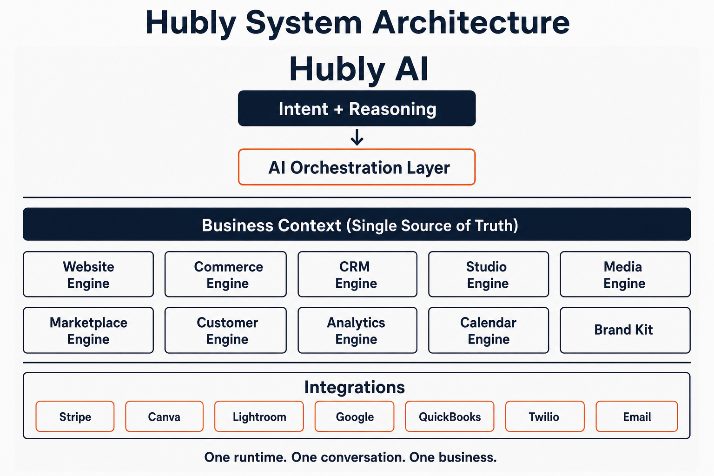
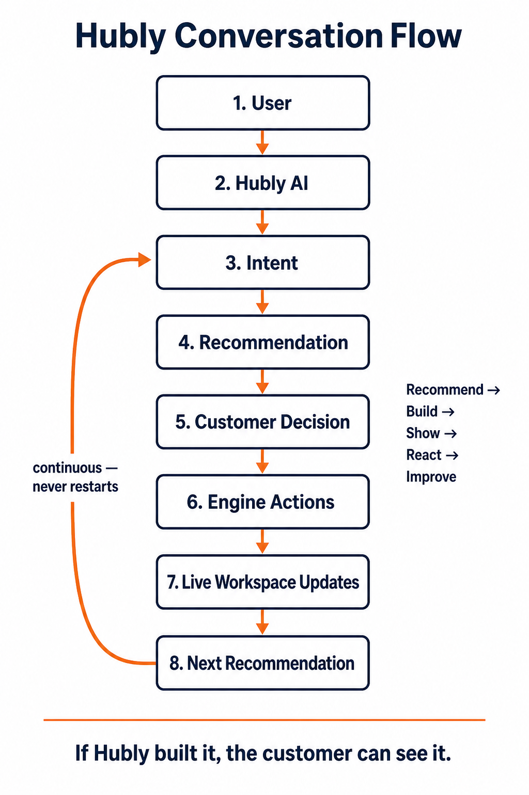
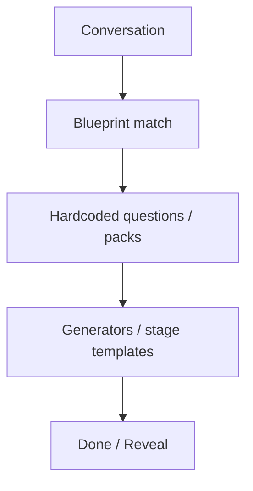
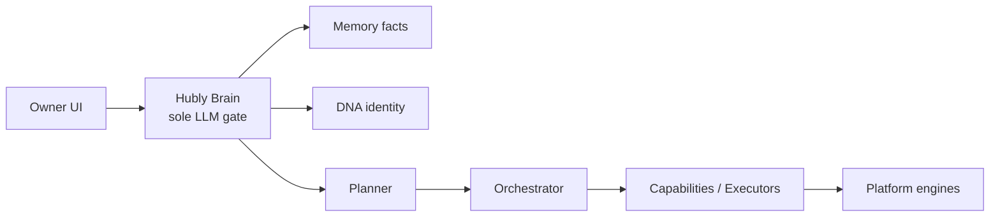
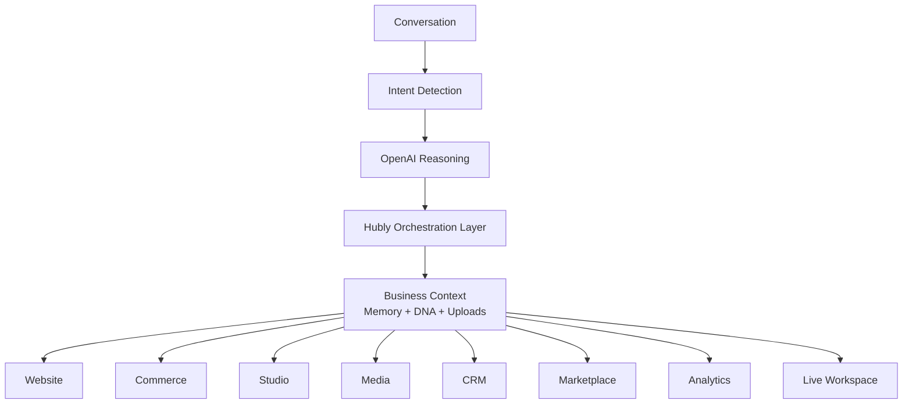
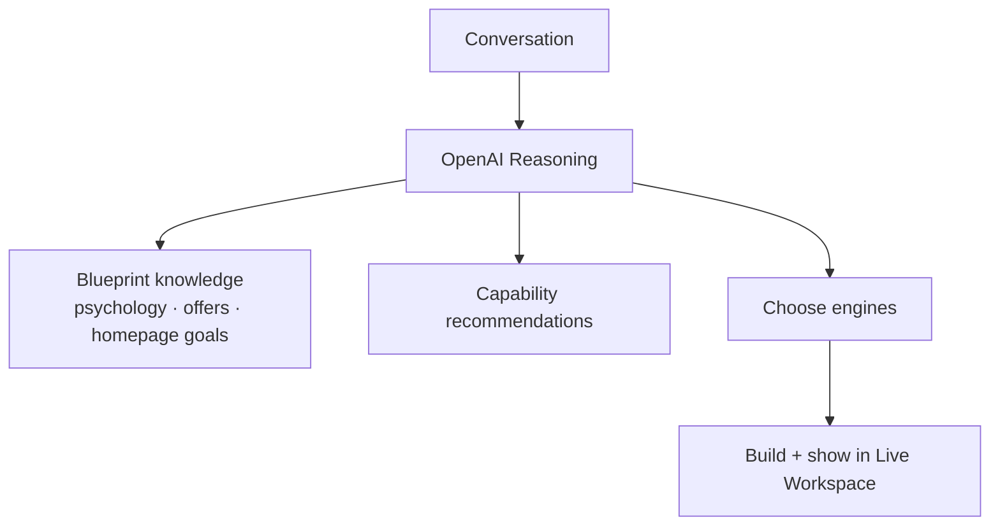
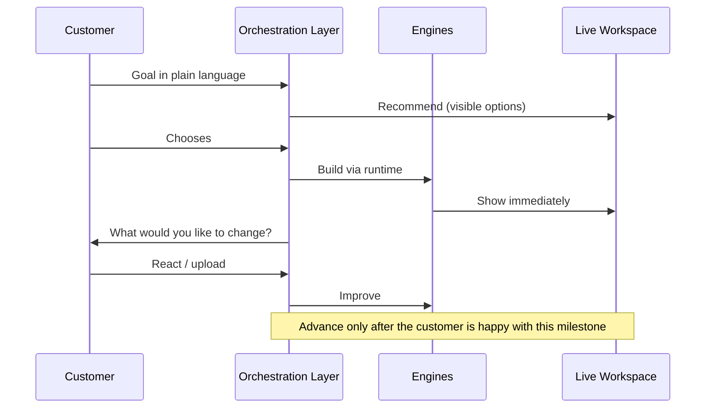
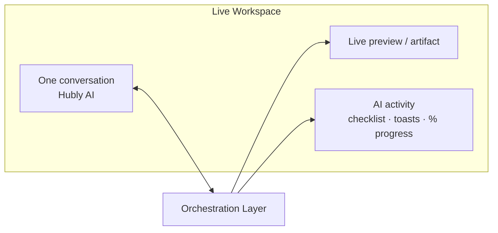

# Hubly AI V2 — Architecture Blueprint

**Status:** 🔒 **Architecture frozen for implementation** (pending final founder sign-off on this revision)  
**Date:** 2026-07-30 (Constitution + visual system)  
**PR:** #371  

This document is the long-term blueprint for Hubly’s next phase. It includes what Hubly believes (Constitution), five-minute visual architecture, current-state findings, the AI Orchestration Layer, engine inventories, Commerce Runtime, Live Workspace, migration strategy, success criteria, and hard guardrails.

**After this freeze: stop refining vision — validate through working product, one milestone at a time.**

---

## 0. Opening principle

# Hubly is not an AI website builder.

**Hubly is an AI operating system for independent businesses.**

The AI orchestrates everything we have already built. It does not merely generate websites.

| Output | Role |
|--------|------|
| Website | One output of the runtime |
| Storefront / Commerce | One output |
| Studio | One output |
| Marketplace | One output |
| CRM | One output |
| Media, Calendar, Analytics, Brand… | Outputs of the same runtime |

Everything is powered by **one Hubly runtime**.  
The customer should never feel like they switched products.  
They should feel: *“I’m building my business with Hubly.”*

**Success metric (locked):**  
Not “Did onboarding finish?”  
→ **Did the customer feel like they built something real with Hubly?**

We optimize for trust, ownership, and momentum — not fewest clicks or fastest setup.

---

## Visual system architecture (five-minute onboarding)

If a new engineer joins Hubly tomorrow, these two diagrams are the platform.

### Diagram A — System architecture



```text
                    Hubly AI
             Intent + Reasoning
                     │
        AI Orchestration Layer
                     │
────────────────────────────────────────
 Business Context (Single Source of Truth)
────────────────────────────────────────
 Website · Commerce · CRM · Studio · Media
 Marketplace · Customer · Analytics · Calendar
────────────────────────────────────────
          Integrations
 Stripe · Canva · Lightroom · Google
 QuickBooks · Twilio · Email
```

### Diagram B — Conversation flow



```text
User
  ↓
Hubly AI
  ↓
Intent
  ↓
Recommendation
  ↓
Customer Decision
  ↓
Engine Actions
  ↓
Live Workspace Updates
  ↓
Next Recommendation  ──(continuous, never restarts)──► Intent
```

Platform loop on every turn: **Recommend → Build → Show → React → Improve**

---

## Hubly’s Constitution (permanent engineering rules)

Do not only describe what we are building. Describe what Hubly **believes**.  
These are permanent engineering rules. Violating them is an architecture bug.

### 1. AI First, Software Second

The customer should never think about modules.  
They should think about accomplishing goals.  
The AI decides which Hubly capabilities to use.

### 2. One Conversation

The customer never switches applications.  
Building a business, growing a business, and getting something done all happen inside one continuous conversation.  
Intent changes naturally. The conversation never restarts.

### 3. One Business

There is only one Business Context.  
Every engine reads from it.  
Nothing owns its own version of the business.

### 4. One Runtime

Website. Commerce. CRM. Studio. Media. Marketplace. Analytics. Calendar. Customers.  
Everything plugs into the same runtime.  
Never create duplicate engines.

### 5. AI Recommends, Humans Decide

The AI should always make recommendations.  
The customer makes the final decision.  
This creates trust.

### 6. Show, Don’t Tell

If Hubly says it built something, the customer should immediately see it.  
No invisible work. No fake progress.  
The preview is proof.

### 7. Every Interaction Creates Momentum

Every conversation should leave the customer with a better business than they had five minutes ago.  
Even small interactions should produce visible improvements.

### 8. The Customer Builds With Hubly

The AI is not completing forms. The AI is collaborating.  
Every milestone should feel like two people designing a business together.

### 9. Progressive Complexity

Never overwhelm a customer.  
Reveal capabilities when they become useful.  
The software should grow with the business.

### 10. Integrations Enhance Hubly

Stripe. Lightroom. Canva. Google. QuickBooks. Anything else.  
These are enhancements. They never become the foundation of the experience.  
**Hubly always owns the business.**

### 11. Hubly Owns The Experience

OpenAI is our reasoning engine.  
It is not our product.

Hubly is responsible for:

- The experience  
- The workflow  
- The business runtime  
- The orchestration  
- The preview  
- The data model  
- The quality  

If we changed from GPT-5.5 to GPT-6, Claude, Gemini, or another model, the customer experience should remain unmistakably **Hubly**.

**The AI model is replaceable. The Hubly experience is not.**

> Related runtime voice rules remain in [`docs/HUBLY_CONSTITUTION.md`](../HUBLY_CONSTITUTION.md) and [`CONSTITUTION_GUIDE.md`](./CONSTITUTION_GUIDE.md).  
> This Constitution governs **platform architecture**. Those documents govern **voice and partner behavior**.

---

## 1. Executive findings (current state)

| Area | Today | Gap vs vision |
|------|-------|----------------|
| Experience | Scripted Discovery → Thinking packs → Architect UI → Reveal | Still a wizard wrapped in chat |
| OpenAI | Configured & working (`gpt-5.5`) on production | Instant Site / `Hubly.think` experts mostly bypass the model |
| Blueprints | Industry JSON that seeds services/layout/booking | Act as conversation controllers — must become knowledge only |
| Engines | Many real surfaces exist | Customer sees tabs/modules, not one continuous conversation |
| Commerce | Schema + Stripe checkout; Store UI → `meta.storeOs` | Incomplete Commerce Runtime; dual SSOT |
| Website | Layouts/themes + generators | Still template-shaped; OpenAI not given creative freedom |
| Live Workspace | Architect shell is a start | Not yet the continuous OS workspace |

**Agreement already reached**

- Overall findings are correct.  
- Reuse engines — do not rebuild Hubly.  
- Blueprints remain as knowledge, not conversation drivers.  
- OpenAI must become the reasoning engine; Hubly runtime connects outputs to the platform.

---

## 2. Current architecture (what ships today)

### 2.1 Today’s flow (problem)



Primary path in `public/hubly.html`:

`startInstantSite` → Discovery (`HUBLY_DISCOVERY`) → Thinking packs → Architect / Creative Build packs → Reveal packs → Save → Operate tabs.

Architect (PR #370) improved the **shell** (chat left / live preview right). The **content** is still pack-driven.

### 2.2 Declared Brain runtime (already built — underused by Instant Site)



Docs: `docs/architecture/SYSTEM_ARCHITECTURE.md`, `supabase/functions/_shared/hubly_ai.ts`.

---

## 3. The AI Orchestration Layer (future)

The AI is **not another engine**.  
It is the **conductor** of the Hubly orchestra.

### 3.1 Target flow



### 3.2 Responsibilities of the Orchestration Layer

For **every** AI response, decide:

| Decision | Question |
|----------|----------|
| Goal | What is the customer trying to accomplish? |
| Intent | Build / Grow / Get something done (dynamic, can shift) |
| Engine | Which Hubly engine(s) should run? |
| Build now | What can we make visible immediately? |
| Recommend | What options should the customer choose among? |
| Ask | What is the **single** decision needed to move forward? |
| Context write | Which facts → Memory? Which identity → DNA? |
| Preview | What patch updates the Live Workspace? |

Implementation home (reuse, don’t reinvent):

`Understanding → Memory + DNA → Planner → Orchestrator → Capabilities → Executors`

OpenAI reasons. Hubly runtime connects. Providers fail honestly when keys are missing.

### 3.3 Blueprints inside the Orchestration Layer

**Do not remove Business Blueprints.** Change their role.



| Forbidden | Required |
|-----------|----------|
| Blueprint → Ask Q1 → Q2 → Q3 | Conversation → Reason → Blueprint recommends → AI decides |
| Blueprints control the script | Blueprints advise options and industry knowledge |

---

## 4. Intent is dynamic — there is no “onboarding product”

We are **not** building an onboarding funnel.  
We are building **continuous AI orchestration**.

### 4.1 Three conversation entry intents (one product)

| Intent | Job | Examples |
|--------|-----|----------|
| **Build my business** | Launch something new | Website, commerce, booking, brand, presence |
| **Grow my business** | Improve what exists | Studio, CRM, customers, reviews, analytics, automation |
| **Get something done** | Help a customer get work done | Cleaning, photography, lawn care — Marketplace path |

These are **not separate products**. The AI transitions naturally:

```
Build storefront → need product photography → Marketplace / Media
                → want marketing → Studio
                → need customers tracked → CRM
```

Same conversation. Same Live Workspace. Same Business Context.

### 4.2 Continuous loop (platform-wide principle)

# Recommend → Build → Show → React → Improve



**Rules**

- Nothing built invisibly.  
- Nothing claimed without being visible.  
- Every milestone produces a visible artifact (preview, cards, logo, packages, catalog, etc.).  
- Uploads are valid moves at every stage.

### 4.3 Replace the questionnaire with collaboration

**Stop interviewing. Start collaborating.**

Example milestone:

> Customer: “I’d like to build a storefront.”  
> Hubly: “I created three directions I think would fit your business.”  
> → Customer chooses → Preview updates → “What would you like to change?”

Every milestone follows that pattern — website, packages, brand, catalog, marketing, job matching.

Predetermined Discovery gaps / talk beats / pack scripts become **fallback knowledge**, never the primary UX.

---

## 5. Uploads as first-class Business Context

Uploads are not attachments on a form. They are **context the AI reasons over** for the rest of the relationship.

| Upload types | Becomes |
|--------------|---------|
| Website URL, Instagram | Competitive / brand / catalog signals |
| Screenshots, Canva, Figma | Design direction |
| Logos, photos | Brand Kit + Media |
| PDFs, menus, price lists, catalogs, service lists | Memory facts (offerings, prices) + DNA tone cues |

**Architecture requirements**

1. Upload affordance in Live Workspace at every stage.  
2. Stored against the business (Media / brand-assets / commerce documents as appropriate).  
3. Referenced in prompts as labeled context — not dumped into Memory as identity.  
4. Facts extracted → **Business Memory**; interpretive style → **Business DNA**; assets → **Media / Brand Kit**.  
5. AI may recommend “use this logo” / “import these products” — customer chooses (Recommend → Build → Show).

---

## 6. Live Workspace (the UI of Hubly)

The Live Workspace is the product surface for continuous orchestration.  
It must **not** feel like a setup wizard.

### 6.1 Composition



| Region | Purpose |
|--------|---------|
| **Conversation** | One continuous thread with Hubly AI |
| **Live preview** | Whatever is being built (site, commerce, campaign, job brief…) |
| **AI activity** | Visible progress: recommendations, builds, sync, checklist |
| **Uploads / compose** | Always available |

### 6.2 Principles

- One conversation. One workspace. Everything updating together.  
- Module names (Website, Studio, CRM) may appear as **capabilities Hubly is using**, not as places the customer “goes.”  
- Power users can still open Operate engines; default path is the Live Workspace.  
- Architect shell (chat left / browser preview right, Live Sync, % Built) is the starting point — evolve it into the permanent OS home, not a one-time onboarding step.

### 6.3 What “alive” means on first entry

When the customer reaches a saved workspace, it already shows:

- Business Context (what Hubly understands)  
- A live website / commerce / booking surface they helped shape  
- CRM / Studio / Media / Calendar **scaffolded** by the same runtime  
- A clear next recommendation — not an empty dashboard

---

## 7. Website Engine — renderer, not template system

### 7.1 Long-term stance

| We do not want | We want |
|----------------|---------|
| Hubly template picker as the creative source | OpenAI creative freedom over layout, branding, copy, structure |
| Industry skins that trap design | Website Engine as a **renderer** connected to runtime |
| “Pick a theme” questionnaires | Recommend 3 directions → build → show |

### 7.2 Responsibilities

| Layer | Owns |
|-------|------|
| **OpenAI (via Brain)** | Creative direction, structure, copy, visual system proposals |
| **Website Engine** | Render/apply patches into live site AST/meta; connect booking, commerce blocks, SEO, domain |
| **Business Context** | Facts (Memory) + identity (DNA) that constrain truthfulness |
| **Brand Kit / Media** | Assets the renderer binds |

### 7.3 Today vs target

| Today | Target |
|-------|--------|
| Layouts/themes under `layouts/`, `themes/`, blueprint-seeded composition | AI proposes structure; renderer materializes; templates optional as **starting knowledge**, not cages |
| `generate-site` / Creative Director / Instant Site packs | All creative calls through Brain; packs demoted to knowledge |
| Preview Engine (Brain) non-mutating | Preview is the Live Workspace surface; apply only after customer choice |

---

## 8. Commerce Runtime (not “Storefront”)

Stop thinking in terms of a “Storefront product.”  
Define a **Commerce Runtime** — capability-based, industry-agnostic.

### 8.1 Commerce Runtime domains

| Domain | Responsibility |
|--------|----------------|
| **Catalog** | Products, variants, collections, bundles, capability flags (physical, digital, print, gift card, membership…) |
| **Orders** | Cart → order lifecycle, line items, status |
| **Customers** | References Customer Engine (`customer_id`) — never duplicate people |
| **Checkout** | Session creation, taxes hooks, success/failure honesty |
| **Payments (abstract)** | `PaymentsProvider` → Stripe Connect today; never simulate paid |
| **Inventory** | Stock levels, deductions, low-stock signals |
| **Shipping (abstract)** | `ShippingProvider` → builtin today; carriers later; fail honest |
| **Digital Delivery** | Assets, entitlements, signed download after pay |
| **Print Fulfillment** | Print SKUs, labs/providers, gallery sell-through |
| **Commerce Analytics** | Sales, conversion, inventory health (derived, not a second ledger) |
| **AI Commerce** | Merchandising, catalog import from uploads, product copy — via Orchestration Layer |

AI decides which **capabilities** to enable from conversation + uploads (not from industry wizards).

### 8.2 What exists vs missing

| Domain | Exists today | Missing / incomplete |
|--------|--------------|----------------------|
| Catalog | `commerce_products`, variants, Store UI CRUD | Owner UI dual-writes `S.storeOs` / `meta` instead of always `commerce-api` |
| Orders | `commerce_orders`, webhook → paid | UI often in-memory/meta; refunds money-movement Stage 2 |
| Customers | Customer Engine + order `customer_id` | Store flows don’t always upsert customers |
| Checkout | `create-store-checkout` → Stripe | Broken if catalog only in `meta.storeOs` |
| Payments | Stripe Connect + webhook | Abstract provider OK; Revenue sync / refunds incomplete |
| Inventory | Deduct + log on paid | Rich ops / alerts partial |
| Shipping | Builtin quotes; Shippo stub refuses | Live carrier rates |
| Digital Delivery | `product_type=digital` flag | **No** asset delivery pipeline |
| Print Fulfillment | Photo “prints” deliverable labels | **No** commerce print path |
| Commerce Analytics | Store Analytics tab (local) | Event-true analytics subscribers |
| AI Commerce | Product-coach / merchandising stubs | Real Brain-orchestrated import & recommend |

**Screenshot note:** `screenshots/Storefront.png` is the **Website service/booking** surface (Pro Shine), not Commerce Runtime product UI. V2 product mocks (Ember & Wick) require Commerce Runtime SSOT first.

### 8.3 Separated: Website Storefront (services) vs Commerce Runtime

| | Website “Storefront” (Operate Module 7) | Commerce Runtime |
|--|----------------------------------------|------------------|
| Sells | Services / packages / booking | Products & product-like capabilities |
| SSOT | Service Engine (`service_catalog`) | `commerce_*` |
| Checkout | Booking checkout | Store checkout |
| AI | Packages as visible cards | Catalog/orders as visible artifacts |

Both are outputs of one OS. AI may enable either or both.

---

## 9. Complete engine inventory

For each engine: exists, completeness, APIs, state, owner, consumers, AI interaction.

### 9.1 Business Context (Memory + DNA + conversation + uploads)

| | |
|--|--|
| **Exists** | `hubly_brain_memory.ts`, `hubly_brain_dna.ts`, conversation/workspace memory, Studio `hubly_studio_business_context.ts` |
| **Completeness** | **Complete** core; Instant Site under-writes DNA; uploads not yet first-class context |
| **APIs** | Via `hubly-brain`, `hubly-build-business`, `hubly-daily`, Studio context builders |
| **State** | `business_memories`, `business_dna`, conversation/workspace tables; prompt labels kept separate |
| **Owns data** | Brain commits Memory/DNA (experts suggest only) |
| **Consumers** | Planner, Daily, Website, Studio, findPro, Coach |
| **AI interaction** | Orchestration Layer always loads labeled Memory + DNA + upload refs; Understanding writes facts vs identity separately |

### 9.2 Website Engine

| | |
|--|--|
| **Exists** | Instant Site + editor in `hubly.html`, `generate-site`, `hubly_brain_website.ts`, Preview Engine, layouts/themes, AST |
| **Completeness** | **Partial–strong** publish path; creative still template/pack influenced |
| **APIs** | `generate-site`, `create-instant-site-account`, `hubly-build-business`, `creative-director` |
| **State** | `businesses.meta.website`, gen columns, Memory `currentWebsite`, IS drafts |
| **Owns data** | Website presentation SSOT in business meta / website runtime; services via Service Engine |
| **Consumers** | Public site, booking, chatbot, Creative Director |
| **AI interaction** | OpenAI proposes; Website Engine renders; Recommend → Build → Show in Live Workspace |

### 9.3 Commerce Runtime

| | |
|--|--|
| **Exists** | `store-commerce.js`, `commerce/*`, `commerce-api`, `create-store-checkout`, schema `20260729120000_commerce_engine.sql` |
| **Completeness** | **Partial** — dual SSOT; digital/gift/print incomplete |
| **APIs** | `commerce-api`, `create-store-checkout`, `commerce-merchandising`, stripe webhook hooks |
| **State** | `commerce_*` tables + `S.storeOs` / meta mirror |
| **Owns data** | Commerce Engine for products/orders; Customers for people; Payments for money |
| **Consumers** | Operate Store, public `/store` renderer, webhooks |
| **AI interaction** | Enable capabilities; import from uploads; never invent stock; show catalog/orders live |

### 9.4 Service Engine / Booking / Packages

| | |
|--|--|
| **Exists** | `service_engine.ts` (frozen), `booking_engine.ts`, booking wizard, smart-quote |
| **Completeness** | **Complete** (frozen); `service.ai` reserved empty |
| **APIs** | Catalog helpers, `create-booking-checkout`, `booking-confirmed`, marketplace booking routes |
| **State** | `businesses.meta.service_catalog`, `S.editorSvcs` / `S.services`, `booking_requests` |
| **Owns data** | Service Engine for catalog; Booking for snapshots; Jobs for calendar jobs |
| **Consumers** | Website, Marketplace, chatbot, Reports |
| **AI interaction** | Recommend package cards; catalog wins; never invent services |

### 9.5 Studio

| | |
|--|--|
| **Exists** | `hubly-studio.js`, `studio-api`, campaign engine, publisher, recommendations |
| **Completeness** | **Partial** (V1 email publish; Canva optional Stage 2) |
| **APIs** | `studio-api` (brand-kit, projects, campaign/*, recommend, queue…) |
| **State** | `studio_*`, `campaign_*`, `S.studioOs` |
| **Owns data** | Studio owns campaigns/assets/queue; reads Business Context |
| **Consumers** | Operate Studio, Media bridge, Ask Hubly → marketing |
| **AI interaction** | Grow intent → recommend campaign directions → build draft → show → publish with approval |

### 9.6 Media / Photography projects

| | |
|--|--|
| **Exists** | `photography-projects.js`, media–studio bridge, Lightroom provider, `analyze-photos` |
| **Completeness** | **Partial–strong** workspace; print *sales* missing |
| **APIs** | Supabase `photography_*`, Adobe edges, `analyze-photos` |
| **State** | `photography_*` tables; `sessionStorage` bridge |
| **Owns data** | Media for assets/projects |
| **Consumers** | Studio, Intent promote/edit, Connected Apps |
| **AI interaction** | Use uploads + project media as context; hand off to Studio/Commerce when selling |

### 9.7 CRM / Customers

| | |
|--|--|
| **Exists** | Operate Customers, `customers` table, customer Memory/Profile Brain modules |
| **Completeness** | **Complete** OS |
| **APIs** | Client Supabase `customers`; Brain customer memory/profile |
| **State** | `customers`, `S.customers`; marketplace customers separate |
| **Owns data** | Customers module (Rule #15) |
| **Consumers** | Jobs, Inbox, Commerce, Studio, Memberships, Ask Hubly |
| **AI interaction** | Create/update with confirmation; Profile vs Memory separation for matching & messaging |

### 9.8 Analytics / Reports / Business Health

| | |
|--|--|
| **Exists** | Reports OS (`S.reportsOs`), `hubly_brain_health.ts`, Daily, Studio counters |
| **Completeness** | Reports OS **complete**; Health **partial** (heuristic) |
| **APIs** | Client aggregates; `hubly-daily`; no dedicated reports edge |
| **State** | `S.reportsOs`; Health computed; studio analytics snapshots |
| **Owns data** | Reports config only; operational data stays with owners |
| **Consumers** | Home, Daily, Coach, Studio KPIs |
| **AI interaction** | Narrate progress; Health as single AI metric; never duplicate ledgers |

### 9.9 Marketplace / findPro

| | |
|--|--|
| **Exists** | `marketplace` edge, `hubly-find-pro`, lite/ops/landing pages |
| **Completeness** | **Partial–strong** matching; invisible marketplace UX rule |
| **APIs** | `marketplace/*`, `Hubly.findPro` |
| **State** | `marketplace_*` tables |
| **Owns data** | Marketplace bookings/providers; services still Service Engine |
| **Consumers** | Customer concierge, provider lite, ops |
| **AI interaction** | “Get something done” intent → findPro; speak jobs, not vendor apps |

### 9.10 Calendar / Jobs

| | |
|--|--|
| **Exists** | Jobs OS, Google Calendar edges, calendar provider |
| **Completeness** | Jobs OS **complete**; Google sync **partial** |
| **APIs** | `jobs` / booking_requests; `google-calendar-*` |
| **State** | `jobs`, GCal connections/events, `S.jobs` |
| **Owns data** | Jobs & Calendar module |
| **Consumers** | Home, Inbox, Reports, booking confirm |
| **AI interaction** | Schedule with confirmation; Intent never names Google |

### 9.11 Brand Kit

| | |
|--|--|
| **Exists** | Studio brand-kit, Settings branding, site logo/color meta, brand-assets storage |
| **Completeness** | **Partial** — three surfaces not fully unified |
| **APIs** | `studio-api` brand-kit; Settings; meta via `buildBizMeta` |
| **State** | `studio_brand_kit`, `settings_branding`, meta logo/color |
| **Owns data** | Intent: Studio kit for creative; Settings for platform branding; DNA for personality (not hex dumps in Memory) |
| **Consumers** | Studio, Website chrome, Media formats |
| **AI interaction** | Recommend logo/palette from uploads; show Brand + site update together |

### 9.12 Email / Messaging

| | |
|--|--|
| **Exists** | `send-customer-email`, `draft-customer-message`, chatbot, booking-confirmed, Inbox OS |
| **Completeness** | **Partial** (email real if Resend keyed; SMS/social Stage 2) |
| **APIs** | Edges above; chatbot tables |
| **State** | Chatbot conversations; Ask Hubly notes; Resend env |
| **Owns data** | Transport only; people/jobs remain CRM/Jobs |
| **Consumers** | Reviews, booking, Studio email publish, site chatbot |
| **AI interaction** | Draft → show → owner approve → send; fail honest without provider |

### 9.13 Payments (abstract)

| | |
|--|--|
| **Exists** | `hubly_provider_payments.ts`, Stripe Connect, booking + store checkout, webhook, Revenue OS |
| **Completeness** | **Partial–strong** Connect/checkout; refunds/Revenue sync incomplete |
| **APIs** | Connect onboard/connection, checkout edges, webhook |
| **State** | `stripe_connect_accounts`; payment fields on bookings/orders; `S.revenueOs` |
| **Owns data** | Payments/Revenue for ledger; engines create sessions only |
| **Consumers** | Booking, Commerce, Memberships hooks |
| **AI interaction** | Enable payments capability; **Provider not configured** if missing — never simulate |

### 9.14 Recommendation / Intent / Action engines

| | |
|--|--|
| **Exists** | `hubly_intent_engine`, `hubly_action_engine`, execution plans, Studio recommendations, event bus |
| **Completeness** | **Partial** — not all Operate actions route through Intent yet |
| **APIs** | Client engines; `studio-api` recommend; Brain plan |
| **State** | Plans in memory/server types; campaign_plans |
| **Owns data** | Intent definitions; operational entities stay with modules |
| **Consumers** | Ask Hubly, Media promote, Studio, Connected Apps |
| **AI interaction** | Orchestration Layer speaks intents → capabilities → approve → execute |

### 9.15 AI / Brain / Collaboration / Coach

| | |
|--|--|
| **Exists** | `hubly_ai.ts` sole LLM gate; `hubly-brain`, Daily, buildBusiness, findPro, Creative Director, experts, Collaboration/Preview |
| **Completeness** | **Complete** core; Collaboration apply **partial**; Instant Site bypasses live reasoning |
| **APIs** | `hubly-brain`, `hubly-daily`, `hubly-build-business`, `hubly-find-pro`, `creative-director`, `hubly-ai-status` |
| **State** | Brain executions/reasoning events; Ask Hubly OS; Instant Site daily state |
| **Owns data** | Brain for AI decisions/runs; Ask Hubly never owns CRM/Jobs/Revenue |
| **Consumers** | Every AI surface |
| **AI interaction** | **This is the Orchestration Layer.** All model calls through Brain; Live Workspace is the UI |

### 9.16 Disconnected / under-connected (honesty)

| Symptom | Examples |
|---------|----------|
| AI bypassed | Instant Site packs; Operate Ask Hubly local parsers |
| Dual SSOT | Commerce `meta.storeOs` vs `commerce_*`; Brand Kit split |
| Scaffold vs live | CRM/Studio/Media created in build path but customer navigates tabs alone |
| Template gravity | Website layouts/themes dominate creative freedom |

V2 connects these — it does not replace them with parallel systems.

---

## 10. Business Context flow & duplication (current → target)

### Current Instant Site (duplicated)

```
Landing session → S._is.discovery.facts → S.biz / S._cd / draft localStorage
→ later HublyAI.buildBusinessMemory → business_memories
(DNA rarely written by Discovery UI)
```

### Target

```
Conversation (+ uploads)
  → Orchestration Layer (OpenAI)
  → Understanding
      → factual patches → Business Memory
      → identity patches → Business DNA
      → assets → Media / Brand Kit / Commerce documents
  → Planner selects capabilities
  → Engines execute
  → Live Workspace shows results
```

**Permanent rule:** Memory (facts) and DNA/Profile (identity) stay separate labeled blocks — never one blob.

---

## 11. OpenAI health (measured 2026-07-30)

| Probe | Result |
|-------|--------|
| `configured.openai` | **true** |
| Model | **gpt-5.5** (Responses transport) |
| `draft-customer-message` | Live OpenAI success (~3.7s) |
| `creative-director` | Live OpenAI success (~9.3s) |
| `hubly-brain` `think` | Templated experts (~100ms) — **not** orchestration-grade reasoning |

**Implication:** Infrastructure is ready. Instant Site must stop bypassing Brain.

---

## 12. Migration strategy — connect Hubly, don’t rebuild it

### 12.1 Principle

We are **not rebuilding Hubly**.  
We are **connecting Hubly** under one Orchestration Layer and one Live Workspace.

### 12.2 Reuse explicitly

| Reuse | Do not duplicate |
|-------|------------------|
| Business Context (Memory + DNA) | Parallel “profile JSON” in the chat client |
| Studio | New “Marketing AI app” |
| Media | Second media library for Architect |
| CRM / Customers | Chat-only contact lists |
| Analytics / Health | Shadow KPIs in onboarding |
| Calendar / Jobs | Fake calendars in preview |
| Recommendation / Intent / Action | Hardcoded decision trees |
| Service Engine | Ad-hoc package arrays per industry script |
| Marketplace / findPro | Separate “hire” product |
| Website Engine | New site builder SaaS beside Hubly |
| Commerce Runtime | Shopify-shaped side system |
| Payments / Email providers | Simulated success paths |

### 12.3 Suggested phases (after architecture approval)

| Phase | Outcome |
|-------|---------|
| **A — Contract** | Orchestration response schema (goal, intent, engines, recommend, build-now, single-decision, preview-patch, memory/dna writes). Packs = fallback only. |
| **B — Live Workspace** | Evolve Architect shell into continuous OS home; Recommend → Build → Show loop; uploads → Business Context. |
| **C — Brain as conductor** | Instant Site / workspace turns call `hubly-brain` for real OpenAI reasoning; experts no longer template-only on this path. |
| **D — Blueprint demotion** | `recommend(context)` API; remove script control from `applyCdBlueprint` conversation path. |
| **E — Commerce SSOT** | Store UI → `commerce-api` only; then AI Commerce + digital/print capabilities. |
| **F — Website renderer** | Creative freedom via Brain; Website Engine applies; templates = knowledge. |
| **G — Intent fluidity** | Build ↔ Grow ↔ Get something done without restart; engines light up in-place. |

No new core Brain layers. Prove by UX: magical build, find a pro, Health, Live Workspace.

---

## 13. Success criteria

Replace “onboarding completed” with:

| Criterion | Observable |
|-----------|------------|
| **Understood the goal** | Intent + Business Context reflect what the customer said (and uploaded) |
| **Continuous progress** | Every turn left something visible in the Live Workspace |
| **Collaborated** | Customer chose among recommendations; reacted; Hubly improved |
| **Alive workspace** | Entering the saved workspace already shows site/commerce/CRM/Studio scaffolds that feel real |
| **One product** | No sense of switching apps between Build, Grow, and Get something done |
| **Trust** | No invisible builds; no fake provider success; Memory/DNA separation held |

Emotional outcome:  
*“I didn’t sign up for software. I built my business.”*

---

## 14. What We Will Not Build

Guardrails for the team as Hubly grows:

1. **We will not** create separate onboarding flows for every industry.  
2. **We will not** create separate products for storefronts, websites, CRM, Studio, or Marketplace.  
3. **We will not** hardcode AI conversations into decision trees or blueprint scripts.  
4. **We will not** duplicate business data across multiple engines (dual SSOTs).  
5. **We will not** require customers to finish a wizard before seeing value.  
6. **We will not** build isolated features that bypass the shared Hubly runtime.  
7. **We will not** invent new core Brain layers — capabilities and experiences only.  
8. **We will not** merge Business Memory (facts) with Business DNA / Customer Profile (identity).  
9. **We will not** simulate payments, shipping, bookings, or provider success when credentials are missing.  
10. **We will not** treat Hubly as an AI website builder — the website is one output of the OS.  
11. **We will not** build invisibly or claim progress the customer cannot see.  
12. **We will not** restart the experience when intent shifts between Build, Grow, and Get something done.  
13. **We will not** let a model provider own the product — OpenAI (or any successor) is replaceable; the Hubly experience is not (Rule #11).  
14. **We will not** treat the AI Workspace as disposable onboarding — it is the permanent home of Hubly AI.

These guardrails keep Hubly a single intelligent platform — not a collection of disconnected tools.

---

## 15. Open questions (before implementation)

1. Live Workspace latency: block on real Brain/OpenAI with Live Sync, or show a short skeleton then refine — without lying about completion?  
2. First-mile default: services/booking first, with Commerce capabilities enabled when AI recommends — or product Commerce in the first Build path?  
3. Brand Kit unification: Studio kit as SSOT for creative, Settings as platform chrome — confirm.  
4. Operate tabs: remain for power users forever, or progressively hide behind conversation for new businesses?

---

## 16. Architecture freeze & implementation roadmap

**Stop architecture theater. Prove the blueprint in product.**

This document + the two visual diagrams + the Constitution (including Rule #11) are the freeze line.  
Further vision refinement without a working AI Workspace is a product risk.

### Product requirement for every feature

Every new feature must answer:

> **How does this make the conversation with Hubly better?**

Not “Which page should this live on?”  
Not “Which tab owns this?”  

Instead: *How does Hubly naturally help the customer accomplish this through the same conversation?*

That question prevents Hubly from drifting back into a collection of disconnected pages.

### Three tests for every implementation

Hold every change to:

1. Does it feel like I’m working with an expert, not software?  
2. Does every interaction produce visible progress?  
3. Does it make Hubly feel more like one product instead of many products?  

If all three are yes — keep going. If not — redesign before shipping.

### Roadmap (phased)

#### Phase 1 — AI Workspace (Milestone 0)

**The workspace is the product. Everything else plugs into it.**

Build the permanent home of Hubly AI — not onboarding chrome that disappears after setup.

| Region | Purpose |
|--------|---------|
| Conversation | AI chats — one continuous thread |
| Preview | Websites, storefronts, campaigns, job briefs appear here |
| Activity | Checklist, sync, progress — proof Hubly is working |
| Shared state | One Business Context for the whole session |

Six months later, the same workspace is still home when the customer says:

- “Build me a Christmas campaign.”  
- “Add subscriptions.”  
- “Find me a product photographer.”  

Studio opens here. Media appears here. Marketplace searches happen here. Customers and analytics surface here.  
**Do not think of this as onboarding. Think of it as Hubly.**

#### Phase 2 — AI Orchestration

Make the model the conductor (replaceable — Rule #11). Hubly owns the experience.

- Business Context  
- Intent detection  
- Recommendations  
- Actions through the Orchestration Layer  
- Response contract: goal · intent · recommend · build-now · single-decision · preview-patch · memory/dna writes  

#### Phase 3 — Collaborative Builder

Inside the workspace, the AI builds with the customer:

- Websites  
- Commerce  
- Booking  
- CRM  
- Studio  

Loop: Recommend → Choose → Build → Show → React → Improve.

#### Phase 4 — Engine Integration

Wire existing engines into the Orchestration Layer (connect, don’t rebuild):

Studio · Media · CRM · Commerce · Marketplace · Analytics · Calendar · Website · Customers

#### Phase 5 — Expansion

Marketing depth, commerce improvements, marketplace, automation, integrations — always as enhancements to the conversation and workspace, never as new products.

### First engineering slice (Phase 1 start)

1. Permanent AI Workspace shell (conversation + preview + activity + shared state)  
2. Survive beyond “setup” — same surface for Grow / Get something done later  
3. Then Phase 2 orchestration contract on `hubly-brain`  
4. Blueprint `recommend` (non-controlling)  
5. Upload → Business Context pipeline  
6. Commerce SSOT migration when Commerce work begins (`commerce_*` only write path)

Constitution (§ Hubly’s Constitution, including **Rule #11**) and **What We Will Not Build** are non-negotiable during implementation.

---

*End of Hubly AI V2 Architecture Blueprint — frozen for implementation.*
